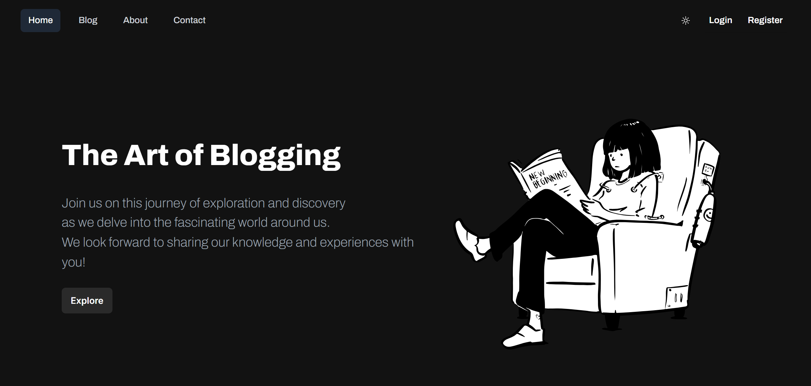
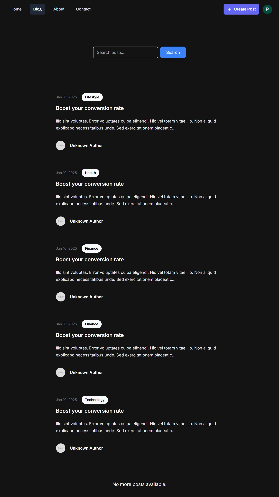
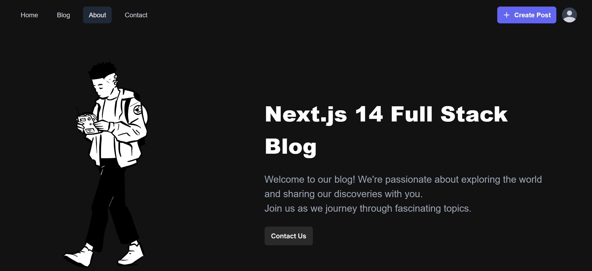
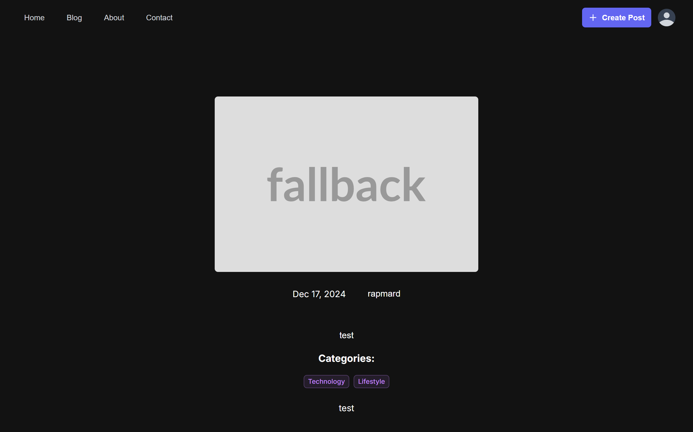
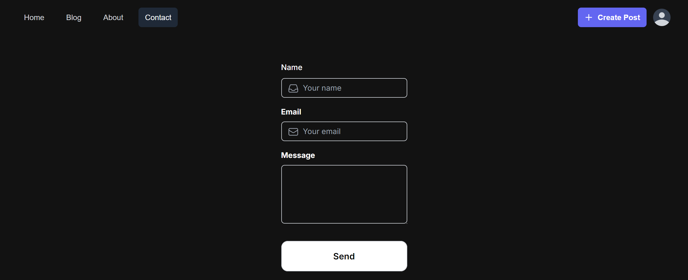
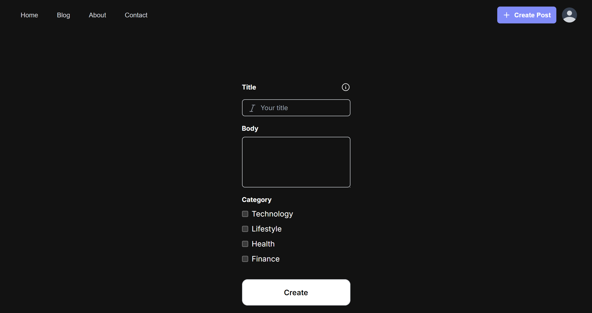
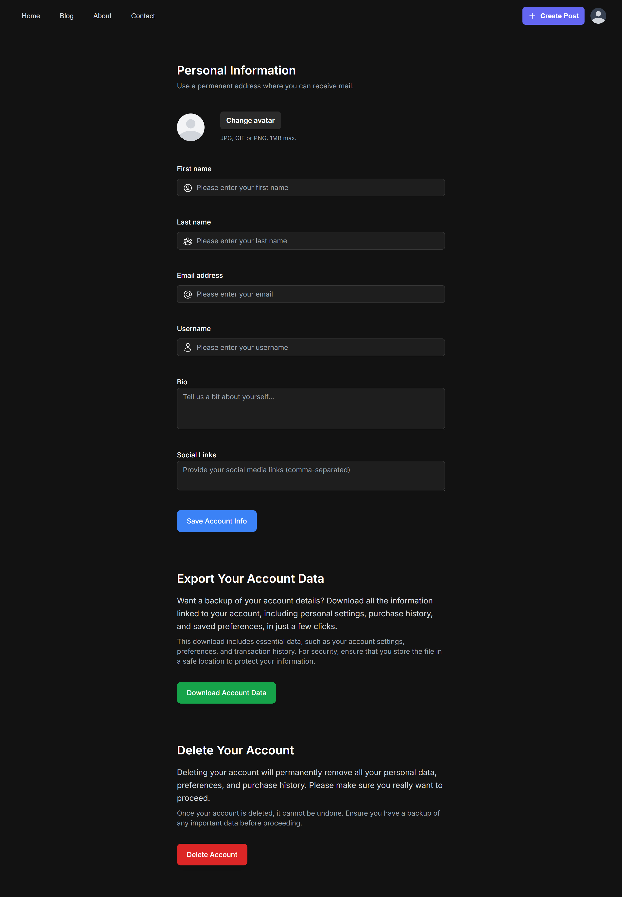

# Full Stack Blog

#### _Powered By Next.js 14_

Full stack, feature rich, modern blogging
web application built with Next.js 14 .

## Table of Contents

- [Full Stack Blog](#full-stack-blog) - [_Powered By Next.js 14_](#powered-by-nextjs-14)
  - [Table of Contents](#table-of-contents)
  - [Tech Stack](#tech-stack)
  - [Environment Variables](#environment-variables)
  - [Run Locally](#run-locally)
  - [Blog Features Checklist](#blog-features-checklist)
    - [Core Features](#core-features)
  - [Profile Management](#profile-management)
  - [SEO Features](#seo-features)
    - [Core SEO Features](#core-seo-features)
    - [Performance Optimization](#performance-optimization)
    - [Content Quality](#content-quality)
    - [Monitoring and Analytics](#monitoring-and-analytics)
    - [Advanced SEO Features](#advanced-seo-features)
    - [Accessibility](#accessibility)
    - [Legal and Compliance](#legal-and-compliance)
    - [Additional SEO Features](#additional-seo-features)
    - [Advanced Features](#advanced-features)
  - [Admin Features](#admin-features)
    - [Community Features](#community-features)
  - [Screenshots](#screenshots)
  - [Appendix](#appendix)

## Tech Stack

This project uses a modern tech stack that ensures high performance, security, and ease of development:

- **[Next.js](https://nextjs.org/)** - A React-based framework that enables server-side rendering and static site generation, providing excellent performance and SEO benefits.
- **[TypeScript](https://www.typescriptlang.org/)** - A superset of JavaScript offering type safety and enhanced code reliability.
- **[Tailwind CSS](https://tailwindcss.com/)** - A utility-first CSS framework that allows for rapid, custom styling with a responsive design.
- **[Zod](https://github.com/colinhacks/zod)** - A schema validation library for TypeScript, ensuring safe and validated data handling.
- **[React Hook Form](https://react-hook-form.com/)** - A performant library for managing forms with minimal re-renders, making forms fast and easy to handle.
- **[Kinde Auth](https://kinde.com/)** - An authentication library for user management, providing login, registration, and security features.
- **[Prisma](https://www.prisma.io/)** - An ORM that provides an intuitive way to work with databases, simplifying data access.
- **[SQLite](https://www.sqlite.org/)** - A lightweight, file-based database ideal for local development.
- **[Resend & React Email](https://resend.com/)** - Tools for sending and managing emails directly from the app, used for notifications and user communication.

This stack is chosen to balance performance, scalability, and developer experience.

## Environment Variables

To run this project, you will need to create a `.env` file in the root directory of your project with the following variables. These are divided into sections for clarity.

### General Configuration

- **`NEXT_PUBLIC_IMAGE_DOMAINS`**: A comma-separated list of domains allowed to host images used in the application (e.g., `example.com,cdn.example.com`).

### Authentication (Kinde Auth)

For user authentication and session management, configure the following Kinde Auth settings:

- **`KINDE_CLIENT_ID`**: Your client ID from Kinde, uniquely identifying the app.
- **`KINDE_CLIENT_SECRET`**: The secret key for client authorization.
- **`KINDE_ISSUER_URL`**: The issuer URL provided by Kinde for token validation.
- **`KINDE_SITE_URL`**: Base URL of your application, used for redirecting and validating sessions.
- **`KINDE_POST_LOGOUT_REDIRECT_URL`**: The URL to which users are redirected after logging out.
- **`KINDE_POST_LOGIN_REDIRECT_URL`**: The URL to which users are redirected after logging in.

### Database (Prisma)

Add this variable in a `.env.local` file in the root directory to specify the local SQLite database URL:

- **`DATABASE_URL="file:./dev.db"`**: Specifies the location of your SQLite database file.

### Email Service (Resend)

For email notifications and communication, provide the Resend API key:

- **`RESEND_API_KEY`**: API key to authenticate and authorize the email-sending service.

### Setting Up the Environment

To avoid potential issues, verify that all variables are correctly set, especially those used for authentication and database connections. Restart the server after any changes to these files to ensure they take effect.

## Run Locally

Clone the project

```bash
  git clone https://github.com/itsteatv/next-js-full-stack-blog.git
```

Go to the project directory

```bash
  cd next-js-full-stack-blog
```

Install dependencies

```bash
  npm install
```

Start the server

```bash
  npm run dev
```

## Blog Features Checklist

### Core Features

- [x] Homepage

  - [x] Blog post summaries or excerpts
  - [x] Navigation menu

- [ ] Post Details Page

  - [x] Full blog post content
  - [x] Author information
  - [x] Post date and time
  - [x] Categories
  - [ ] Tags

- [ ] Post Management

  - [x] Create, edit, delete, and publish posts.
  - [ ] Draft and schedule posts.
  - [x] Categories for organizing content.
  - [ ] Tags for organizing content.
  - [x] Post previews before publishing.

- [ ] Comments

  - [ ] Enable/disable comments on posts.
  - [ ] Comment moderation (approve, reject, or delete comments).
  - [ ] Nested comments or replies.
  - [ ] User authentication for commenting.
  - [ ] Spam filtering.
  - [ ] Highlight top comments, making discussions more engaging.

- [ ] User Management

  - [x] User registration and login.
  - [x] User roles (admin, user, guest, subscriber).
  - [x] User profiles and avatars.
  - [x] User permissions and access control.

- [ ] Search Functionality

  - [x] Search bar for finding posts.
  - [ ] Filters and sorting options (by date, popularity, etc.).

- [ ] Content Display

  - [x] Responsive design for different devices.
  - [x] Featured images or media for posts.
  - [ ] Related posts or recommended reading.
  - [x] Pagination or infinite scroll.
  - [ ] Display a list of popular tags to help users discover content.

  ## Profile Management

  - [ ] **Profile Editing**  
         Allow users to update their basic information, including:

    - [x] Display name
    - [ ] Email address (with email verification upon change)
    - [x] Bio and social links

  - [ ] **Profile Picture Upload**  
         Enable users to upload or update their profile pictures, ensuring:

    - [x] Default avatars if no picture is uploaded

  - [ ] **Account Settings**  
         Provide options for managing account preferences, such as:

    - [ ] Privacy settings to control visibility of profile elements

    - [ ] Linked accounts for social media or external login providers

  - [ ] **Password and Security**  
         Include options for updating passwords and enhancing account security:

    - [ ] Change password feature with current password verification
    - [ ] Two-factor authentication setup
    - [ ] Option to view recent account activity and log out from other sessions

  - [ ] **Data Management**  
         Allow users to manage their data in compliance with privacy standards:
    - [x] Download account data as a JSON file
    - [x] Delete account (permanent deletion with confirmation)

## SEO Features

### Core SEO Features

- [ ] **Meta Tags**

  - [ ] Implement dynamic meta titles for each page/post.
  - [ ] Create unique meta descriptions for each page/post.
  - [ ] Optimize title tags for length and keyword relevance.
  - [ ] Implement meta robots tags to control indexation.

- [x] **Open Graph & Twitter Cards**

  - [x] Ensure Open Graph tags are set for all pages.
  - [x] Set up Twitter card metadata for sharing.
  - [x] Customize images for Open Graph and Twitter cards.
  - [x] Validate Open Graph and Twitter card implementation using debugging tools.

- [x] **Alt Text for Images**

  - [x] Add descriptive `alt` attributes to all images.
  - [x] Use relevant keywords in alt text without keyword stuffing.
  - [x] Review and update alt text for existing images.

- [ ] **Structured Data**

  - [ ] Implement schema markup for articles, authors, and any relevant content.
  - [ ] Use JSON-LD for structured data implementation.
  - [ ] Test structured data with Google’s Rich Results Test tool.
  - [ ] Implement schema for breadcrumbs for better navigation.

- [ ] **Sitemap and Robots.txt**

  - [ ] Create and maintain a `sitemap.xml` file.
  - [ ] Add a `robots.txt` file to control crawling.
  - [ ] Ensure the sitemap includes all important pages and is updated regularly.
  - [ ] Submit the sitemap to Google Search Console.

- [ ] **Canonical Tags**

  - [ ] Implement canonical tags to avoid duplicate content issues.
  - [ ] Audit canonical tags to ensure they point to the correct URLs.
  - [ ] Review canonical tag usage in pagination and archives.

### Performance Optimization

- [ ] **Image Optimization**

  - [ ] Use responsive image formats (e.g., WebP).
  - [ ] Ensure lazy loading is enabled for images.
  - [ ] Compress images without losing quality.
  - [ ] Implement image CDNs for faster delivery.

- [ ] **Mobile Optimization**

  - [x] Test responsiveness on various devices.
  - [ ] Ensure fast loading times on mobile.
  - [x] Use mobile-friendly navigation.
  - [x] Optimize touch targets for mobile users.

- [ ] **Caching**

  - [ ] Implement browser caching for static resources.
  - [ ] Use a content delivery network (CDN) for faster load times.
  - [ ] Optimize server response time.

### Content Quality

- [ ] **Content Freshness**

  - [ ] Regularly update old blog posts with new information.
  - [ ] Repurpose existing content into new formats (e.g., video, infographics).
  - [ ] Identify and remove outdated content.

- [ ] **User Engagement**

  - [ ] Add internal linking to related posts.
  - [ ] Encourage comments and discussions.
  - [ ] Use call-to-action (CTA) buttons effectively.
  - [ ] Conduct regular surveys to understand user interests.

### Monitoring and Analytics

- [ ] **Analytics Integration**

  - [ ] Set up Google Analytics to track user behavior.
  - [ ] Implement Google Search Console for indexing and performance insights.
  - [ ] Monitor key performance indicators (KPIs) regularly.
  - [ ] Set up conversion tracking for specific goals.

- [ ] **Broken Link Check**

  - [ ] Use tools to regularly check for and fix broken links.
  - [x] Implement a 404 error page with useful navigation options.
  - [ ] Redirect broken links to relevant pages.

### Advanced SEO Features

- [ ] **Social Signals**

  - [ ] Add social sharing buttons to posts.
  - [ ] Encourage sharing through social media.
  - [ ] Monitor social media engagement metrics.
  - [ ] Create shareable content (e.g., infographics, quotes).

- [ ] **Local SEO**

  - [ ] Implement local business schema if applicable.
  - [ ] Optimize for local keywords in your content.
  - [ ] Claim and optimize your Google My Business listing.
  - [ ] Collect and respond to customer reviews.

### Accessibility

- [x] **Semantic HTML**

  - [x] Use semantic elements (like `<article>`, `<header>`, etc.) for better structure.
  - [x] Ensure proper heading structure (H1, H2, H3).
  - [x] Implement ARIA roles where necessary.

- [ ] **Keyboard Navigation**

  - [ ] Ensure the site is navigable via keyboard for accessibility.
  - [ ] Test focus states for interactive elements.
  - [ ] Provide skip links to improve navigation for screen reader users.

### Legal and Compliance

- [ ] **GDPR Compliance**

  - [ ] Include a privacy policy and cookie consent banner.
  - [ ] Implement user data protection measures.
  - [ ] Allow users to request data deletion.

- [ ] **Accessibility Compliance**

  - [ ] Ensure compliance with WCAG (Web Content Accessibility Guidelines).
  - [ ] Conduct regular accessibility audits.
  - [ ] Provide accessibility resources and contact information for support.

### Additional SEO Features

- [ ] **User Experience (UX)**

  - [ ] Conduct user testing to identify pain points in navigation.
  - [ ] Analyze user behavior through heatmaps and session recordings.
  - [x] Optimize layout and design for better user engagement.

- [ ] **Voice Search Optimization**

  - [ ] Optimize content for voice search queries (natural language, questions).
  - [ ] Use structured data to enhance voice search results.
  - [ ] Consider featured snippets and local search results for voice queries.

- [ ] **Video SEO**

  - [ ] Optimize video titles, descriptions, and tags for search.
  - [ ] Create video sitemaps to index video content effectively.
  - [ ] Use closed captions and transcripts for accessibility and SEO.

- [ ] **Content Diversification**

  - [ ] Explore various content formats (podcasts, webinars, etc.).
  - [ ] Create interactive content (quizzes, polls) to boost engagement.
  - [ ] Implement user-generated content strategies (reviews, testimonials).

- [ ] **A/B Testing**

  - [ ] Conduct A/B tests on landing pages to improve conversion rates.
  - [ ] Test different headlines, images, and calls-to-action.
  - [ ] Analyze results and make data-driven decisions for future optimizations.

- [ ] **Competitor Analysis**

  - [ ] Regularly analyze competitors’ SEO strategies and performance.
  - [ ] Identify content gaps and opportunities in your niche.
  - [ ] Monitor competitors’ backlink profiles for potential link-building opportunities.

- [ ] **Link Building**

  - [ ] Develop a strategy for acquiring high-quality backlinks.
  - [ ] Conduct outreach to relevant sites for guest posting.
  - [ ] Monitor backlinks regularly for quality and relevance.

- [ ] **Content Strategy**

  - [ ] Develop a content calendar to ensure consistent publishing.
  - [ ] Focus on pillar content and topic clusters for better organization.
  - [ ] Identify seasonal content opportunities to capitalize on trends.

- [ ] **Regular Audits**

  - [ ] Schedule regular SEO audits to identify areas for improvement.
  - [ ] Analyze site health, performance, and compliance with best practices.
  - [ ] Review content performance to make informed updates.

- [ ] **User Feedback and Adaptation**

  - [ ] Implement feedback loops to gather user insights and adjust strategies.
  - [ ] Use surveys and polls to understand user preferences and content interests.

### Advanced Features

- [ ] Social Media Integration
  - [ ] Social sharing buttons.
  - [ ] Social media feeds or widgets.
  - [ ] Auto-posting to social media platforms.
- [ ] Monetization
  - [ ] Ad placement and management.
  - [ ] Affiliate links and product reviews.
  - [ ] Subscription or membership models.
  - [ ] E-commerce integration (for selling products or services).
- [ ] Content Management
  - [ ] Media library for managing images, videos, and files.
  - [ ] Content import/export tools.
  - [ ] WYSIWYG or markdown editor for content creation.
  - [ ] Custom post types (e.g., events, reviews).
- [ ] Customization and Branding
  - [ ] Custom themes and templates.
  - [ ] Widgets and sidebars.
  - [ ] Custom headers and footers.
  - [ ] Color schemes and fonts.
- [ ] User Interaction

  - [ ] Contact forms and feedback mechanisms.
  - [ ] Quizzes, interactive infographics, surveys or polls
  - [ ] Newsletter subscription.
  - [ ] Users can bookmark or save posts for later reading

- [ ] Security Features
  - [ ] SSL/TLS encryption.
  - [ ] Two-factor authentication.
  - [ ] Backup blog content and settings.
  - [ ] User activity logs.
- [ ] Performance Optimization
  - [ ] Caching mechanisms.
  - [ ] Content Delivery Network (CDN) integration.
  - [ ] Lazy loading for images and videos.
- [ ] Accessibility Features
  - [ ] Alt text for images.
  - [ ] Keyboard navigation support.
  - [ ] Screen reader compatibility.
- [ ] Localization and Internationalization
  - [ ] Multi-language support.
  - [ ] Regional settings (date formats, currency).
  - [ ] Auto-translate or integrate with translation services like Google Translate.
- [ ] Notifications
  - [ ] Email notifications for new posts or comments.
  - [ ] Push notifications for updates.
- [ ] Legal and Compliance
  - [ ] Privacy policy and terms of service.
  - [ ] GDPR compliance features.
  - [ ] Cookie consent.
  - [ ] Analytics and Reporting
  - [ ] Track page views, post views, and user engagement

## Admin Features

- [ ] Dashboard
  - [ ] Overview of post statistics, comments, and user activity
- [ ] User Roles and Permissions
  - [ ] Manage user roles and permissions
- [ ] Content Moderation
  - [ ] Review and manage content before publication
- [ ] Customizable Themes
  - [ ] Choose or customize blog themes and layouts
- [ ] Advanced Comment Management
  - [ ] Comment moderation queue
  - [ ] Spam filtering

### Community Features

- [ ] User-generated Content
  - [ ] Guest posts.
  - [x] User profiles with bios and links.
- [ ] Forums or Discussion Boards
  - [ ] Threads and topics for community discussions.
  - [ ] User reputation or ranking system.

## Screenshots

`Home Page (Signed-In)`


`Home Page (Signed-Out)`



`Blog Page`



`About Page`



`Single Post Page`



`Contact Page`



`Create Post Page`



`Dashboard`



## Appendix

This project will get bigger and better, so i won't leave it without any update or new features.
