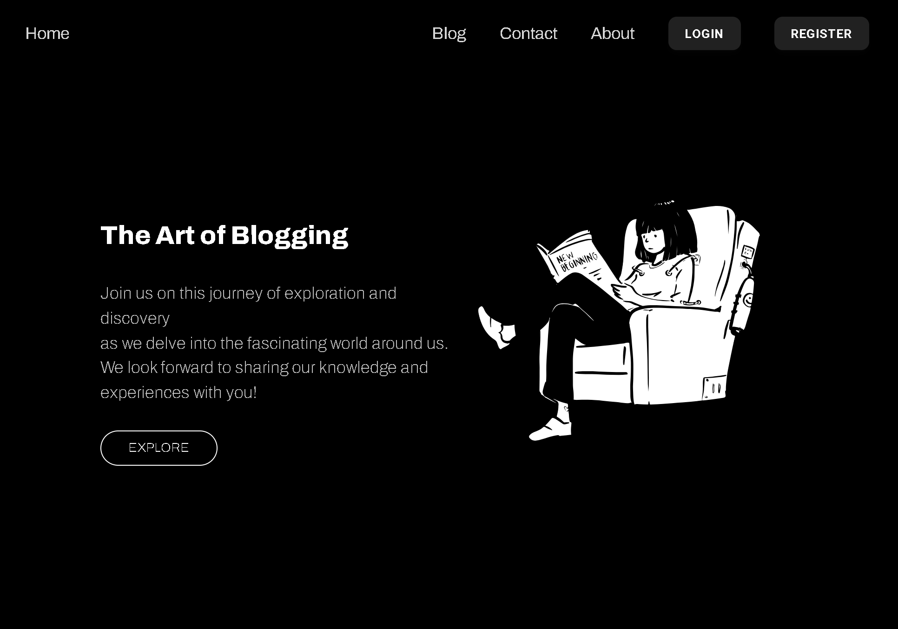
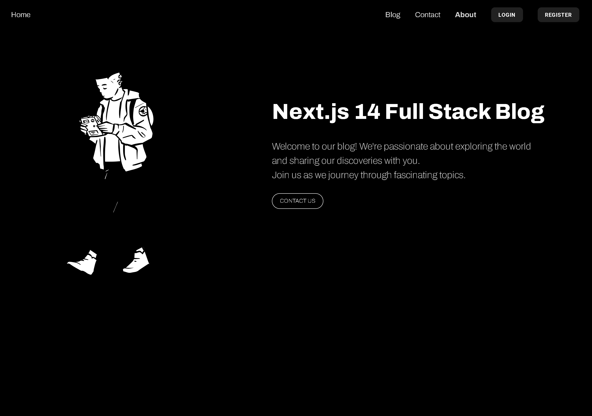
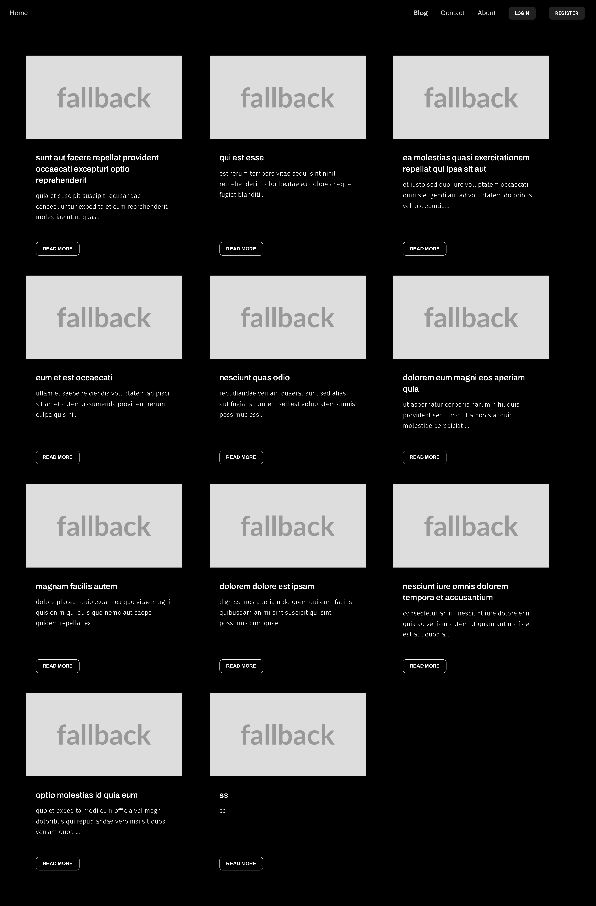
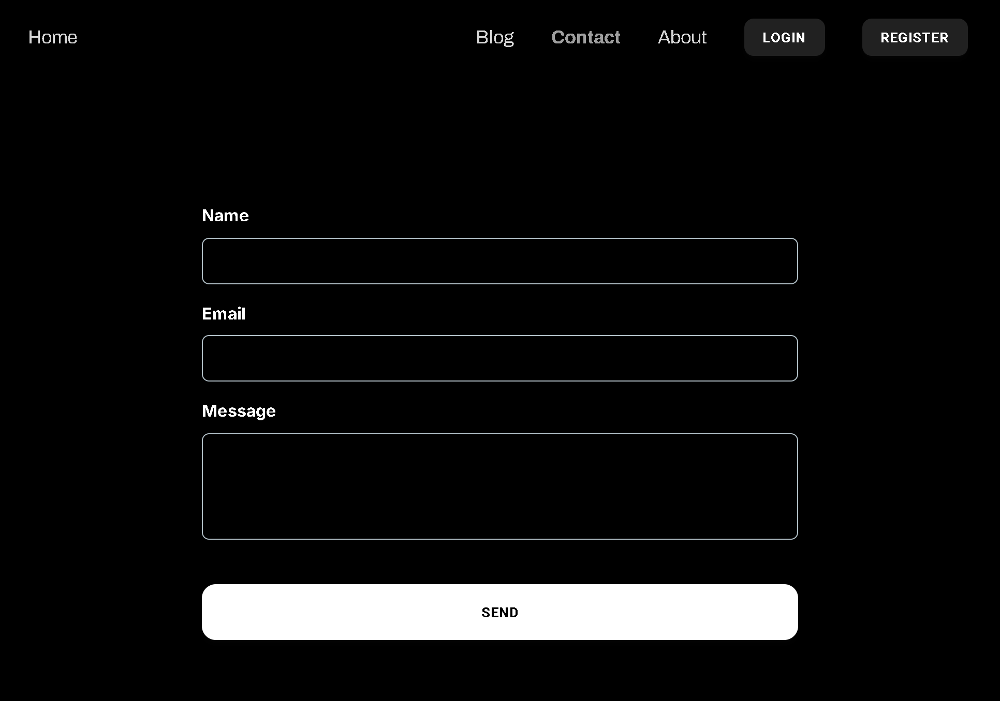
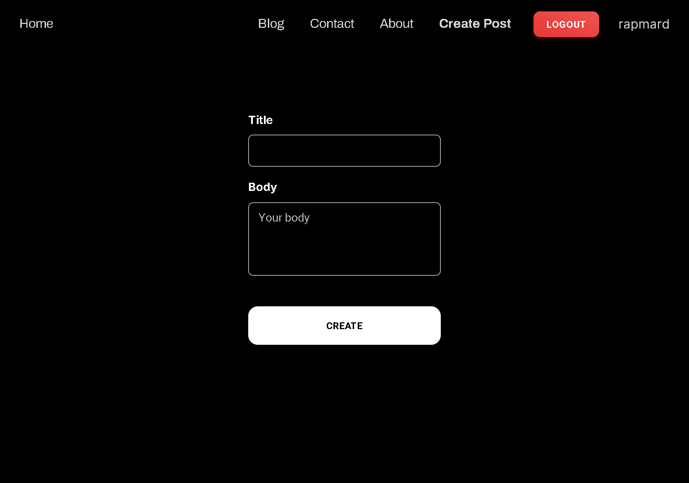

# Full Stack Blog

#### _Powered By Next.js 14_

Full stack, feature rich, modern blogging
web application built with Next.js 14 .

## Tech Stack

- Next.JS(React)
- Typescript
- TailwindCSS
- Zod
- React Hook Form
- Kinde Auth
- Prisma ORM
- SQLite
- Resend, React Email

## Environment Variables

To run this project, you will need to add the following environment variables to your .env file

`RESEND_API_KEY`

`NEWS_API_KEY`

`KINDE_CLIENT_ID`

`KINDE_CLIENT_SECRET`

`KINDE_ISSUER_URL`

`KINDE_SITE_URL`

`KINDE_POST_LOGOUT_REDIRECT_URL`

`KINDE_POST_LOGIN_REDIRECT_URL`

`NEXT_PUBLIC_IMAGE_DOMAINS`

## Run Locally

Clone the project

```bash
  git clone https://github.com/itsteatv/next-js-full-stack-blog.git
```

Go to the project directory

```bash
  cd next-js-full-stack-blog
```

Install dependencies

```bash
  npm install
```

Start the server

```bash
  npm run dev
```

## Blog Features Checklist

### Core Features

- [x] Homepage
  - [x] Blog post summaries or excerpts
  - [x] Navigation menu
- [ ] Post Details Page
  - [x] Full blog post content
  - [x] Author information
  - [x] Post date and time
  - [x] Categories
  - [ ] Tags
- [ ] Post Management
  - [x] Create, edit, delete, and publish posts.
  - [ ] Draft and schedule posts.
  - [x] Categories for organizing content.
  - [ ] Tags for organizing content.
  - [x] Post previews before publishing.
- [ ] Comments
  - [ ] Enable/disable comments on posts.
  - [ ] Comment moderation (approve, reject, or delete comments).
  - [ ] Nested comments or replies.
  - [ ] User authentication for commenting.
  - [ ] Spam filtering.
- [ ] User Management
  - [x] User registration and login.
  - [ ] User roles (admin, editor, author, contributor, subscriber).
  - [ ] User profiles and avatars.
  - [x] User permissions and access control.
- [ ] Search Functionality
  - [x] Search bar for finding posts.
  - [ ] Filters and sorting options (by date, popularity, etc.).
- [ ] Content Display
  - [x] Responsive design for different devices.
  - [x] Featured images or media for posts.
  - [ ] Related posts or recommended reading.
  - [x] Pagination or infinite scroll.
- [ ] SEO Features
  - [ ] Meta titles and descriptions.
  - [ ] SEO-friendly URLs.
  - [ ] Schema markup for rich snippets.
  - [ ] XML sitemap.

### Advanced Features

- [ ] Social Media Integration
  - [ ] Social sharing buttons.
  - [ ] Social media feeds or widgets.
  - [ ] Auto-posting to social media platforms.
- [ ] Monetization
  - [ ] Ad placement and management.
  - [ ] Affiliate links and product reviews.
  - [ ] Subscription or membership models.
  - [ ] E-commerce integration (for selling products or services).
- [ ] Content Management
  - [ ] Media library for managing images, videos, and files.
  - [ ] Content import/export tools.
  - [ ] WYSIWYG or markdown editor for content creation.
  - [ ] Custom post types (e.g., events, reviews).
- [ ] Customization and Branding
  - [ ] Custom themes and templates.
  - [ ] Widgets and sidebars.
  - [ ] Custom headers and footers.
  - [ ] Color schemes and fonts.
- [ ] User Interaction

  - [ ] Contact forms and feedback mechanisms.
  - [ ] Quizzes, interactive infographics, surveys or polls
  - [ ] Newsletter subscription.
  - [ ] Users can bookmark or save posts for later reading

- [ ] Security Features
  - [ ] SSL/TLS encryption.
  - [ ] Two-factor authentication.
  - [ ] Backup blog content and settings.
  - [ ] User activity logs.
- [ ] Performance Optimization
  - [ ] Caching mechanisms.
  - [ ] Content Delivery Network (CDN) integration.
  - [ ] Lazy loading for images and videos.
- [ ] Accessibility Features
  - [ ] Alt text for images.
  - [ ] Keyboard navigation support.
  - [ ] Screen reader compatibility.
- [ ] Localization and Internationalization
  - [ ] Multi-language support.
  - [ ] Regional settings (date formats, currency).
- [ ] Notifications
  - [ ] Email notifications for new posts or comments.
  - [ ] Push notifications for updates.
- [ ] Legal and Compliance
  - [ ] Privacy policy and terms of service.
  - [ ] GDPR compliance features.
  - [ ] Cookie consent.
  - [ ] Analytics and Reporting
  - [ ] Track page views, post views, and user engagement

## Admin Features

- [ ] Dashboard
  - [ ] Overview of post statistics, comments, and user activity
- [ ] User Roles and Permissions
  - [ ] Manage user roles and permissions
- [ ] Content Moderation
  - [ ] Review and manage content before publication
- [ ] Customizable Themes
  - [ ] Choose or customize blog themes and layouts
- [ ] Advanced Comment Management
  - [ ] Comment moderation queue
  - [ ] Spam filtering

### Community Features

- [ ] User-generated Content
  - [ ] Guest posts.
  - [ ] User profiles with bios and links.
- [ ] Forums or Discussion Boards
  - [ ] Threads and topics for community discussions.
  - [ ] User reputation or ranking system.

## Screenshots

`Home Page`



`About Page`



`Blog Page`



`Single Post Page`


`Contact Page`



`Create Post Page`



## Appendix

This project will get bigger and better, so i won't leave it without any update or new features.
